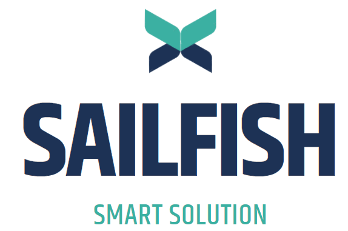
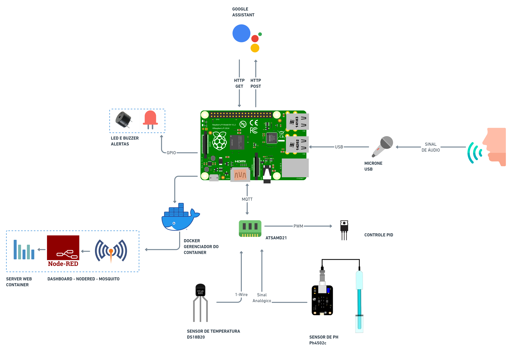

> Develop an embedded system that by capturing audio and using a Google Assistant API to identify and interpret the incoming audio content in order to control by voice the temperature of a pool.

## Requirements
* Capture audio with a microphone and use the Raspberry Pi's internal hardware.
* Develop software layer capable of connecting Google Assistant API with microprocessor.
* Define and configure key phrases for pool temperature control.
* Develop pool PID control system.
* Develop software layer capable of connecting PID control with Google Assistant.
* Create hardware capable of capturing pool temperature
* Communicate hardware layer with pool heating system.
* Trigger alarm for possible adversities.
* Display temperature data using Node-Red.
* Send temperature data using protocol

## Technologies

### Hardware
 Raspberry Pi 3 B+

 ATSAMD21+

### Software
 Python

 C

 C++

### APis
 Google Assistant

 Node-RED 

## Schedule
|  PC 	|                                                               Contents                                                               	| Date       	|
|:---:	|:------------------------------------------------------------------------------------------------------------------------------------:	|------------	|
| PC1 	| Project proposal (justification, objectives, requirements, benefits, literature review).                                             	| 06/08/2021 	|
| PC2 	| Functional prototype of the project, using the most basic tools from the development board, ready-made libraries, etc.               	| 03/09/2021 	|
| PC3 	| Refinement of the prototype, adding basic system resources (multiple processes and threads, pipes, signals, semaphores, MUTEX etc.). 	| 08/10/2021 	|
| PC4 	| Refinement of the prototype, adding real-time Linux features.                                                                        	| 22/10/2021 	|

## Diagram


## Run Project

```sh
make runproject
```


