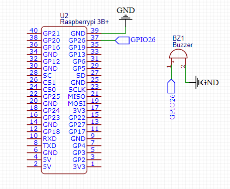

# Sinalization LEDs

## Circuit Layout


## Initial Tests

After the circuit assembled, the initial test of the GPIos, to check the connections with the Raspberry Pi 3 B+.

### GPIOs

```sh
# Buzzer Test with GPIO Library

gpio export 26 out
gpio -g write 26 1
gpio -g write 26 0

```
## Library