# RPi and Google Assistant Integration

## Microphone and Speaker

Before running the sample, you must configure the audio system on the Raspberry Pi

1. Locale microphone
```sh
arecord -l
```

2. Locale speaker
```sh
aplay -l
```

3. Create a new file named .asoundrc in the home directory (/home/pi) and insert:
```sh
pcm.!default {
      type asym
      capture.pcm "mic"
      playback.pcm "speaker"
}
pcm.mic {
      type plug
      slave {
            pcm "hw:<card number>,<device number>"
      }
}
pcm.speaker {
      type plug
      slave {
            pcm "hw:<card number>,<device number>"
      }
}
```
4. Verifify that recording and playback work:

* Adjust the playback volume:
```sh
alsamixer
```

* Play a test sound (this will be a person speking). Press Ctrl+C when done.
```sh
speaker-test -t wav
```

* Record a short audio clip.
```sh
arecord --format=S16_LE --duration=5 --rate=16000 --file-type=raw out.raw
```

* Check the recording by replaying it.
```sh
aplay --format=S16_LE --rate=16000 out.raw
```

## Register device

1. Go to page [Google Console](https://console.actions.google.com/u/0/) and click in New Project

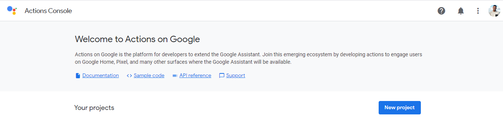

2. After, name project and define language and country
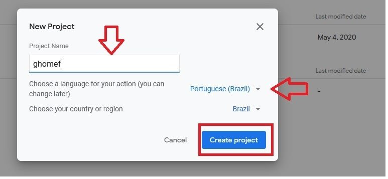

3. Scroll down to the bottom of the page and click in device registration

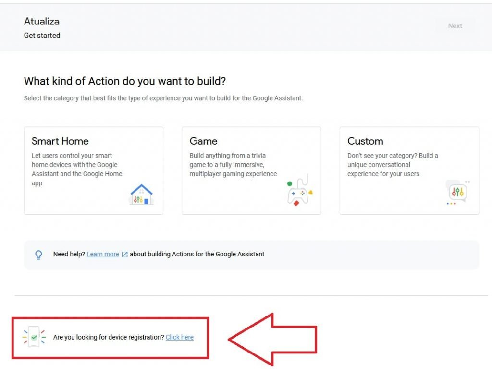

4. Click em Register Model

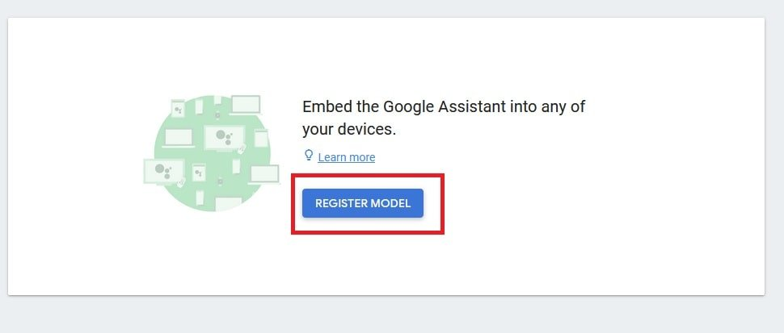

5. Put a name for product and define manufacturer and device type.

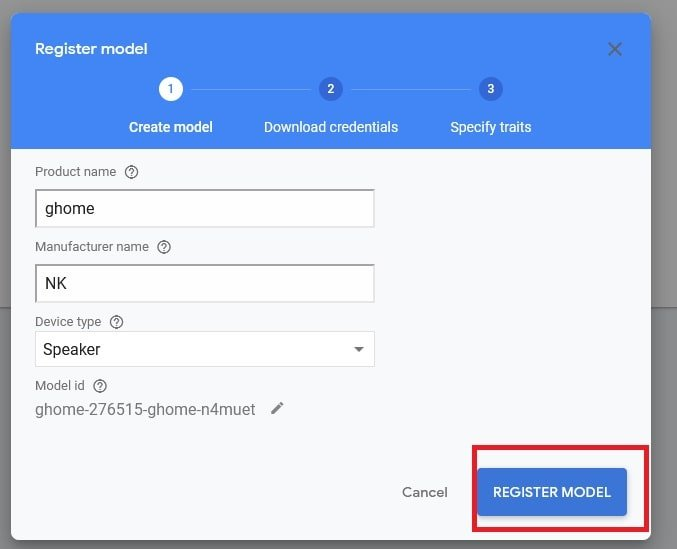

6. Click Download OAuth 2.0 credentials

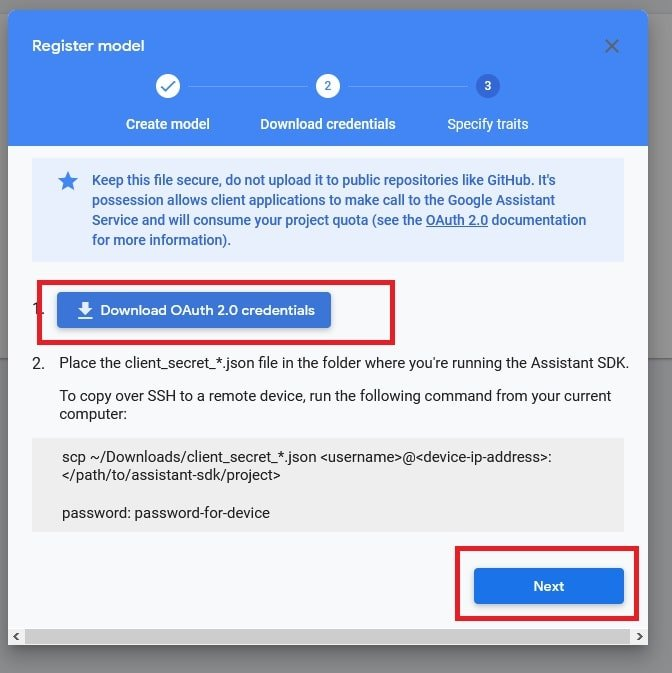

7. Specify traits, choose SKIP

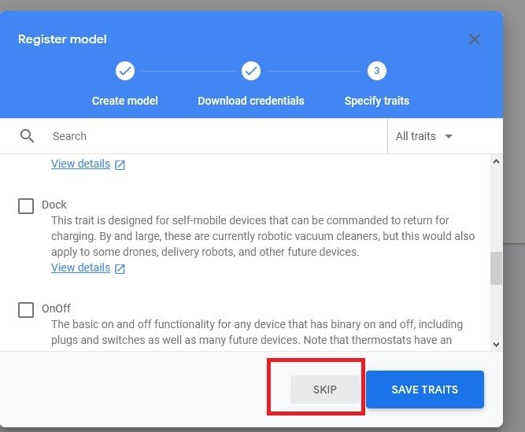

8. Go to [Painel de API's](https://console.cloud.google.com/apis/dashboard) and to select current project in navbar. After click in Enable APis and Services

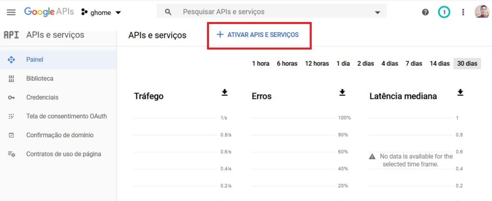

9. Seach for  “Google Assistant”

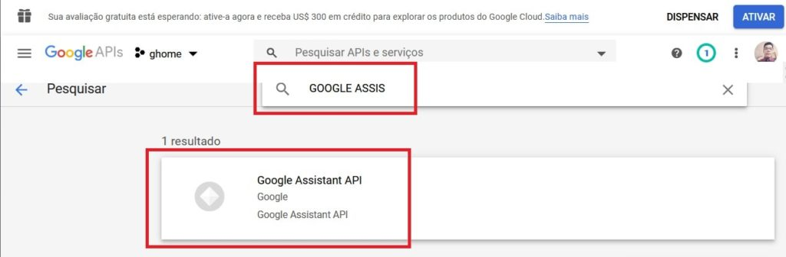

10. Click in enable

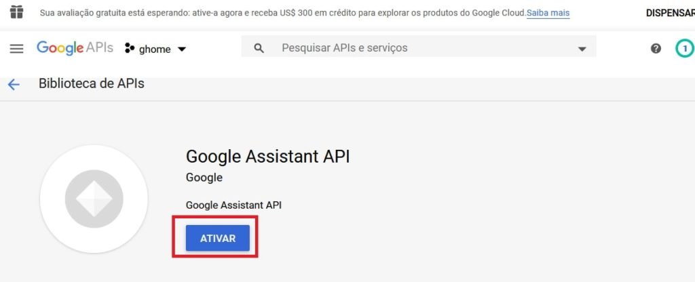

11. Go to [Console](https://console.cloud.google.com/apis/credentials/consent) and click edit application

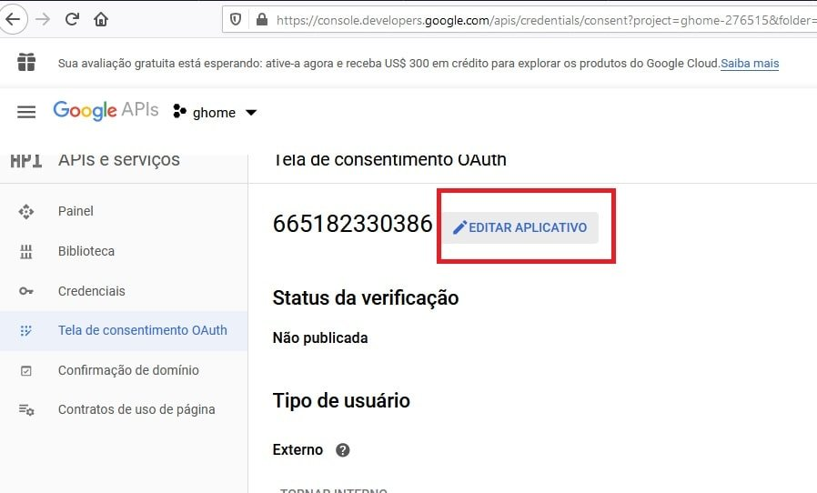

12. Fill in the field below with the email

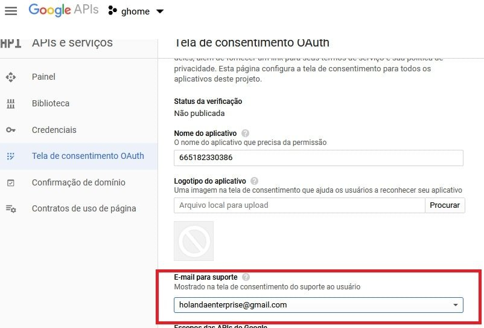

13. Add the users for acess in device

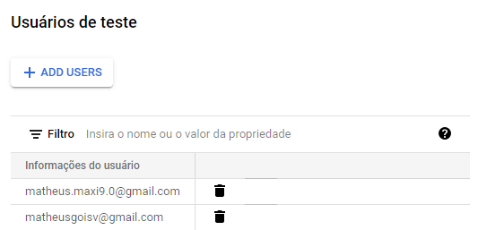

## Device RPi

1. Run requirements.sh
```sh
./requirements.sh
```
2. Copy credentials.json to RPi (/home/pi)
```sh
scp client_secret_776423823553-fr9n6qrst5f7q9lhnj1tcpnlgc2o6g5k.apps.googleusercontent.com.json pi@10.0.0.160:
```
3. Generate device credentials using google-oauthlib-tool:
```sh
google-oauthlib-tool --scope https://www.googleapis.com/auth/assistant-sdk-prototype --scope https://www.googleapis.com/auth/gcm  --save --headless --client-secrets path/to/client_secret_<client-id>.json
```
4. Teste Google Assistant
```sh
googlesamples-assistant-pushtotalk --device-model-id 'my-device-model-id' --project-id 'project-id'
```

5. Run Google Assistant

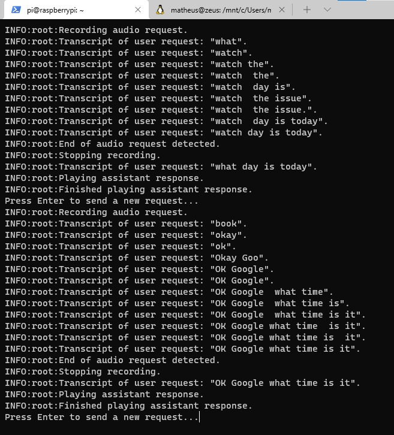
