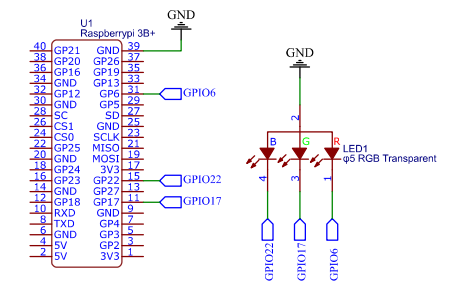

# Sinalization LEDs

## Circuit Layout


## Initial Tests

After the circuit assembled, the initial test of the GPIos, to check the connections with the Raspberry Pi 3 B+.

### GPIOs

```sh
# Test GPIO 17 => LED Green
echo "17" > /sys/class/gpio/export
chmod -R 777 /sys/class/gpio/gpio17
echo "out" > /sys/class/gpio/gpio17/direction
echo "1" > /sys/class/gpio/gpio17/value
echo "0" > /sys/class/gpio/gpio17/value

# Other tests with GPIO Library

# LED Blue
gpio export 22 out
gpio -g write 22 1
gpio -g write 22 0

# LED Red
gpio export 6 out
gpio -g write 6 1
gpio -g write 6 0

```
## Library
Functions from rgb.h

```c

int RGBGreen(int value);    // Light on green
int RGBBlue(int value);     // Light on blue
int RGBRed(int value);      // Light on green
void RGBOff();              // Power off all leds
```

## Test

```sh
./rgb.out red
./rgb.out blue
./rgb.out green
./rgb.out off
```