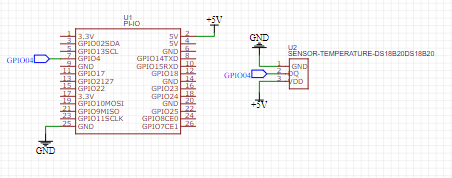

# Read temperature with voice

## Circuit Layout


## Initial Tests

After the circuit assembled, the initial test of the GPIos, to check the connections with the Raspberry Pi 3 B+.

## Sets
```sh
sudo nano /boot/config.txt
# Check there are dtoverlay=w1-gpio in last line? 
```

```sh
sudo modprobe w1-gpio
sudo modprobe w1-therm
cd 28-*
cat w1_slave
```

## Teste

In C/C++
```sh
make
./sensor.out
```

In python
```sh
python get_temp.py

> (28.125, 82.625)
> (28.125, 82.625)
> (28.187, 82.73660000000001)
> (26.812, 80.2616)
```